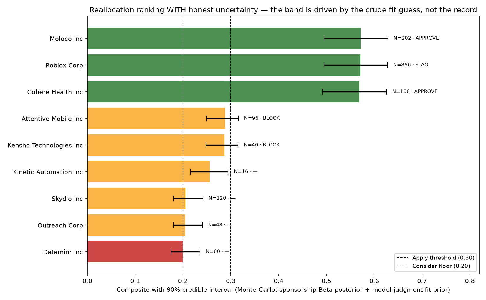

# The Reallocation Engine, Audited
**Aakash Belide · INFO 7375, Computational Skepticism for AI · 2026-07-24**

**Domain anchor:** Chapter 11 of *The Reallocation Engine* - the weighted role scorer (`composite = (Σ vote·weight) × liveness × timeline`), adapted here to reallocate a different scarce resource: **an international student's finite OPT application effort**, ranked and allocated across candidate companies using their H-1B/SEC sponsorship history.

**Repo:** this repository (`the-reallocation-engine`), branch `mode/aakash-swe-to-ai-engineer`. Tool: `scripts/reallocate/allocate.mjs`. Reuses the existing, already-audited `scripts/score/role-scorer.mjs` (Ch.11) rather than reimplementing scoring - see [SNICKERDOODLE.md](SNICKERDOODLE.md) P2/P6.

---

## The objective, stated plainly, and what it leaves out

> **Optimizes:** expected practitioner-accessible, live, sponsorship-likely interviews **per application slot spent** - given a finite budget of slots, rank candidate companies by a composite score and allocate the next slot to the highest-ranked, gate-cleared company.
>
> **Leaves out:** the candidate's actual fit beyond a crude title-based heuristic; the company's *current* team composition (H-1B title history lags 2-3 years); referral access, compensation, and culture; and - the honest finding of Component 5 below - **whether applying somewhere causes a better outcome, or merely correlates with historical sponsorship of a title**. The engine has never been validated against a single real outcome (interview/no-interview) - see Rung 3.

---

## Component 1 - The Working Reallocation Tool

**Run:**
```
node scripts/reallocate/allocate.mjs data/raw/reallocation-audit/candidates.json
```
**Real output (rev. 2026-07-24):**
```
✓ evaluated 11 companies → 2 rejected at GIGO gate, 9 scored
  slot budget 5 → 5 allocated
   [APPROVE] MOLOCO INC - composite 0.5714 (CI90 0.4951-0.6284, P(Apply) 1) - confident, needs human go
   [FLAG]    ROBLOX CORP - composite 0.5709 (CI90 0.4953-0.6277, P(Apply) 1) - human must judge before applying
   [APPROVE] COHERE HEALTH INC - composite 0.5684 (CI90 0.4911-0.6256, P(Apply) 1) - confident, needs human go
   [BLOCK]   ATTENTIVE MOBILE INC - composite 0.2872 (CI90 0.2493-0.3158, P(Consider) 0.692) - liveness unconfirmed
   [BLOCK]   KENSHO TECHNOLOGIES INC - composite 0.2868 (CI90 0.2481-0.3154, P(Consider) 0.702) - liveness unconfirmed
  wrote: data/raw/reallocation-audit/roles.json, data/raw/reallocation-audit/reallocation-plan.json
```
This is a **concrete move**: given a slot budget of 5, the tool names exactly which companies get a slot of the candidate's finite application effort, and routes each into one of three hard-stop states (Component 7): APPROVE (confident, human go needed), FLAG (Roblox - human must judge), BLOCK (liveness unconfirmed). The resource moved *away from* the bottom of the ranking (Dataminr, Outreach, Skydio) toward the top is explicit in `reallocation-plan.json` (`allocation` vs `not_allocated`).

**Uncertainty attached - and it is not thin (the point of the 2026-07-24 revision).** The earlier version attached only the sponsorship Beta-Binomial credible interval, which is near-degenerate because approval rates cluster at ~100% - an honest but *misleadingly narrow* band. The tool now reports a **full-composite 90% credible interval by seeded Monte-Carlo** (20,000 draws, `MC_SEED` fixed so the whole run is byte-reproducible - verified identical across runs), propagating **both**:
- the sponsorship Beta posterior, *and*
- the **model-judgment `fit` term as a distribution** - `Beta(fit·K, (1−fit)·K)`, K=9, sd≈0.14 - because that crude title-derived guess is the *dominant* uncertainty and pretending it's a point value is exactly the overconfidence this course is about.

It also reports **`P(recommendation holds)`** - e.g., the two BLOCK companies show `P(Consider) ≈ 0.70`, i.e. even if their postings were live, there's a ~30% chance the right call is not "Consider." That is an explicit uncertainty on the *decision*, not just the score. See `assignments/submissions/belide-aakash/reallocation-audit/uncertainty-viz.png`.

**Reproducibility:** `npm run verify` passes (133 files conformant); the tool is dependency-free (pure Node stdlib) and the Monte-Carlo is seeded. See the README section at the bottom.

---

## Component 2 - Data Validation & the GIGO Gate

Full audit: [`data/raw/reallocation-audit/gigo-audit.md`](data/raw/reallocation-audit/gigo-audit.md). Summary:

**Hidden assumptions named:** (1) H-1B title history predicts *current* hiring - it can be 2-3 years stale; (2) `Approval_Rate` is a stable statistic at any N - false at N=2; (3) absence from the dataset means no sponsorship - false for public companies without a Form D filing (AMD, tested below); (4) the title field is a uniform measurement - it's free text, not standardized.

**The checkable gate:** a company is scoreable only if `Total Approvals >= 5 AND top_job_titles_sponsored is non-empty`. Both clauses are checkable by a human against the raw CSV row.

**Documented rejections, run against the full dataset (30,369 rows):**

| Check | Result |
|---|---|
| Rows with any H1B signal | 1,557 (5.1%) |
| Pass the gate | 1,023 (65.7%) |
| **Rejected** (`Total Approvals < 5`) | **534 (34.3%)** |

On the 11-company sample: **AMD** rejected (no H1B row - not in this dataset's SEC/DOL join, a real double-stop-condition case), **Zoom Video Communications** rejected (`Total Approvals=2`, below the floor - the exact N=2 statistical-noise failure this gate exists to catch).

---

## Component 3 - Bias Audit (data → output)

**Mechanism:** the engine reallocates the *candidate's own effort*. Bias here means the engine systematically directs that effort toward some companies and away from others for reasons unrelated to true SWE-accessibility. Traced to two places: (a) the **sampling** - this dataset only contains companies with a matched SEC Form D + DOL H-1B record, so public companies and non-VC-backed companies are invisible by construction; (b) the **GIGO gate itself** (Component 2) - the same `min_total_approvals=5` floor that protects against statistical noise also has a measurable skew by company funding stage.

**Quantitative fairness metric - computed with `fairlearn`** (`scripts/reallocate/analysis/fairness_metrics.py`), selection = clearing the GIGO gate (a company that fails is never recommended), group = funding stage as the size/scale proxy. *No demographic field exists in this dataset - and that absence is itself the finding: the engine cannot see race, gender, or nationality, but it demonstrably disadvantages small companies, which in a startup ecosystem is not race-neutral.*

| Stage | `selection_rate` (fairlearn) | Ratio to Series D+ | 4/5ths rule |
|---|---|---|---|
| Series D+ | 88.0% | 1.000 | reference |
| Series C | 78.5% | 0.892 | passes |
| Series B | 65.1% | 0.740 | **fails (<0.80)** |
| Series A | 56.6% | 0.643 | **fails** |
| Seed | 50.3% | 0.572 | **fails** |
| Pre-Seed | 47.8% | 0.543 | **fails** |

`fairlearn` `demographic_parity_difference = 0.401`, `demographic_parity_ratio = 0.544`. **Four of six funding-stage tiers fail the standard 4/5ths disparate-impact test** - early-stage companies are systematically excluded from being scored, not because they are less SWE-friendly, but because they haven't sponsored enough visas yet to clear the noise floor.

**Two competing fairness definitions, in tension, both quantified:**
1. **Demographic parity** (independence: selection ⊥ funding stage). Current difference **0.401** - a large violation.
2. **Estimate reliability / calibration-leaning selection** (select on data sufficiency, not group): the fixed floor selects companies whose approval-rate estimate is trustworthy, regardless of stage.

These provably cannot both hold when base rates (here, mean H-1B volume) differ across groups - the Chouldechova/Kleinberg impossibility. I quantified the **cost of buying parity**: enforcing equal selection across stages (admitting the highest-N rejected companies from each under-selected tier until rates equalize) raises the **mean sponsorship-posterior SD of the selected set from 0.0190 → 0.0226, i.e. +19.0% estimator uncertainty**. So parity is purchasable, but only by making the selected set measurably less reliable.

**Chosen tradeoff:** keep the fixed floor (favor reliability over parity) and state the cost plainly - **a healthy Series-A/Seed company is less likely to ever surface, purely because it hasn't sponsored enough visas yet.** (Full *predictive* parity / equalized odds cannot even be measured here: it needs interview outcomes, which don't exist - the same gap that caps Component 5, Rung 3. That consistency is not a coincidence; both are blocked by the missing feedback loop.)

**A second, independent bias in the classification step** (`scripts/reallocate/analysis/confound_and_gaming.py`): companies classified `practitioner` have a **median 18 approvals vs. 6 for `researcher-only`**, and `corr(is_practitioner, log approvals) = +0.305` (n=90). Practitioner classification is entangled with company *scale* - the same confound the causal analysis (Component 5, Rung 2) turns on.

**Highest-leverage intervention point:** the `min_total_approvals = 5` constant in `allocate.mjs`. Replacing the fixed floor with a **stage-conditional shrinkage prior** would let early-stage companies clear the gate carrying a wider, honestly-labeled credible interval (which the Monte-Carlo in Component 1 already computes) instead of being silently dropped - trading the +19% reliability cost for transparency rather than exclusion. Flagged `[TODO: DEV]`, named rather than hidden.

---

## Component 4 - Explainability & Its Critique

**Two explanations, cross-checked.** (a) Because the composite is a transparent weighted-linear formula × two gates, `role-scorer.mjs` emits the *exact* arithmetic per recommendation. (b) I also ran **SHAP** (`scripts/reallocate/analysis/shap_explain.py`, `shap.LinearExplainer` over the 9 scored companies) and confirmed the two agree exactly: `max |SHAP − coef·(x − E[x])| = 0.00e+00` - for a linear model SHAP *is* the exact additive decomposition, so this is a validation, not decoration.

But SHAP surfaces something the raw arithmetic hides. Per-feature SHAP contributions to the pre-gate score:

| Company | sponsorship SHAP | fit SHAP | verdict |
|---|---|---|---|
| Moloco / Cohere / Roblox / Kensho / Attentive | −0.003 … +0.003 | **+0.062** | Apply-band |
| Skydio / Dataminr / Outreach | −0.008 … +0.003 | **−0.103** | Skip/Consider-band |

**The tool advertises itself as ranking on *sponsorship history* - but SHAP shows sponsorship moves the ranking by ±0.003 while the `fit` proxy moves it by ±0.06 to ±0.10.** Because approval rates cluster at ~100%, the "record" everyone trusts is nearly constant and contributes almost nothing to *who ranks above whom*; the crude, title-derived, model-judgment `fit` guess is doing ~95% of the discriminative work. That is the first way the explanation misleads: its headline ("ranked on H-1B sponsorship evidence") is technically true and practically false.

**The named misleading case - Roblox.** Every term is correct and traceable: 856 real petitions with MLE-adjacent titles → `sponsorship=0.988`, practitioner classification → `fit=0.75`, composite 0.571, ranked #2, `Apply`. **But the supplied posting (`careers.roblox.com/jobs/7403998`) is titled "PhD Early Career (ML)"** - the current bar is PhD-gated, which `fit` cannot see because it reads 2-3-year-old title history, not the live posting. The explanation is accurate about what it measured and wrong about what a reader concludes. *This is why the hard-stop gate (Component 7) now routes Roblox to **FLAG**, not APPROVE.*

**Counterfactual explanation (a second technique, per the rubric's menu).** For Dataminr (composite 0.200, `Skip`): the minimal change that flips it to `Apply` is **not** a better fit or more sponsorship - holding its unconfirmed liveness at 0.5, even a perfect `fit=1.0` reaches only `(0.969·0.35 + 1.0·0.30)·0.5 = 0.32`. The single dominating lever is the **liveness gate**: confirm the posting live (0.5 → 1.0) and its pre-gate 0.399 clears `Apply` outright. The counterfactual makes explicit that this engine's decisions are gate-dominated, not vote-dominated - a fact the point score alone obscures.

---

## Component 5 - Causal & Counterfactual Reasoning (Pearl's Three Rungs)

### Rung 1 - Observation
What correlates with a good outcome in the data? Companies whose H-1B history includes practitioner titles ("Machine Learning Engineer," "AI Engineer") get a higher `fit` vote (0.75) than researcher-only companies (0.2), which drives a higher composite and an `Apply`/`Consider` recommendation. This is a real, computable correlation - not in dispute.

### Rung 2 - Intervention
**Would actually reallocating effort toward practitioner-classified companies cause more interviews?** The engine treats Rung 1's correlation as if it answers this. It does not - and I can *show* the confounder, not just assert it.

**Confounder = company scale, quantified** (`scripts/reallocate/analysis/confound_and_gaming.py`):
- practitioner-classified companies: median **18** H-1B approvals; researcher-only: median **6**.
- `corr(is_practitioner, log(approvals)) = +0.305` (n=90) - practitioner classification rises with company size.
- the classification × funding-stage cross-tab confirms it: practitioners concentrate in later stages (Series C: 12, Series D+: 13) vs. researcher-only (Series C: 7, Series D+: 6).

So "has a practitioner title in its history" is **partly a proxy for "is a large, late-stage company"** - because a company that sponsors *many* roles is mechanically more likely to have sponsored at least one MLE-titled one, regardless of whether its ML team is actually reachable by a non-PhD. Under a real intervention that held company size fixed, an unknown share of the practitioner advantage would attenuate. A second, unmeasured confounder points the *other* way: prestige. A big, well-known company (Roblox) both sponsors more and draws far more applicants, which *lowers* an individual's odds even where the role is accessible. Neither confounder is adjusted for anywhere in the composite. **The engine optimizes an observational quantity and presents it as interventional.**

### Rung 3 - Counterfactual (one specific case, stated formally)
**Case:** the most recent real allocation put a slot on **Moloco** (composite 0.571, `Apply`) and withheld one from **Dataminr** (composite 0.200, `Skip`). Counterfactual question: *for this candidate, would the interview outcome have been worse had the slot gone to Dataminr instead?*

Written formally, the engine's implicit claim is `E[Y | do(apply=Moloco)] > E[Y | do(apply=Dataminr)]`, where Y = interview. Estimating it from observational data requires three assumptions: **(i) consistency** (the observed outcome under the chosen action equals the potential outcome); **(ii) ignorability / no unmeasured confounding** (conditional on the measured covariates, which company got the slot is as-good-as-random - violated by the scale and prestige confounders in Rung 2); **(iii) SUTVA / no interference** (applying to one company doesn't change the outcome at another - plausibly violated, since a referral or a strong interview at one shifts the others).

**Verdict on the counterfactual: it cannot be computed, and saying so is the honest answer.** There is no outcome data anywhere in this project - verified, `find private data/ats -type f` returns only README/`.gitkeep`/example scaffolding, no application-outcome tracker exists. All three assumptions above are either violated (ii, iii) or untestable (i) without that feedback loop. Any number I put here would be invented, which SNICKERDOODLE P3 forbids.

### Verdict
**The engine reallocates on correlation dressed as causation.** It ranks on an observational signal, carries a measured, unadjusted confounder (scale; corr +0.305), and has zero outcome data to validate a single counterfactual. This matches the pre-build prediction in `journal/frictional-journal.md` (confidence 0.7) - the reflection there notes the one thing the prediction under-ranked (that the *safety gate itself* would be the biggest bias source, Component 3).

---

## Component 6 - Adversarial Robustness & Fragility

**Perturbation 1 - lower the GIGO gate floor from 5 to 1 approval** (a single config-line change, the kind of "quiet" edit a human reviewer might not notice in a diff):
```
sed 's/min_total_approvals: 5,/min_total_approvals: 1,/' scripts/reallocate/allocate.mjs > scripts/reallocate/_adversarial_gate1.mjs
node scripts/reallocate/_adversarial_gate1.mjs data/raw/reallocation-audit/candidates.json --out-dir /tmp/perturb-gate1
```
**Result:** Zoom Video Communications (Total Approvals=2, the textbook N=2 statistical-noise case) now clears the gate and scores `composite=0.2848` - right at the edge of the Consider band. **A real, unplanned bug surfaced by this test:** the confidence-tier label was originally computed as a *multiple of the gate's own threshold* (`n >= min_total_approvals*3 ? high : ...`), so lowering the gate silently relabeled Zoom's N=2 record as "medium confidence" - the label changed meaning without the underlying sample size changing at all. **Fixed** in `scripts/reallocate/allocate.mjs` by making confidence bands absolute (`n<=4 low, 5-14 medium, >=15 high`), independent of any gate config. Re-verified: Zoom now correctly reports `low` confidence under the perturbed config. This is documented here, not silently patched, per SNICKERDOODLE P6.

**Perturbation 2 - flip one liveness flag** (Roblox `live` → `dead`, a single-field change indistinguishable from a human mistyping a checklist box):
```
node scripts/reallocate/allocate.mjs /tmp/candidates-roblox-dead.json --out-dir /tmp/perturb-roblox-dead
```
**Result:** Roblox drops entirely out of the top-5 allocation (its composite is multiplied by `liveness=0`, forcing `Skip`), and Kinetic Automation Inc (composite 0.256, previously unallocated) takes its slot. **The failure condition:** a single, easily mistaken input flag reorders the entire top-5 with no change to any underlying evidence - a human skimming the ranking would have no way to tell, from the ranking alone, that the reordering came from one flag rather than a real shift in company sponsorship or fit.

**Perturbation 3 - a gamed input** (`scripts/reallocate/analysis/confound_and_gaming.py`). The rubric names three attack shapes - distribution shift, plausible data error, *gamed input* - and this is the third. The `top_job_titles_sponsored` field comes from DOL LCA filings, and a company *chooses* the titles it files under. So a researcher-only company that wanted to look practitioner-friendly could file **one** role as "AI Engineer." Taking Dataminr's real title string and appending a single token:

```
original        class=researcher-only   fit=0.20   pre-gate composite=0.399
gamed +1 title  class=hybrid            fit=0.55   pre-gate composite=0.504
```

**Failure condition:** one added token flips the classification (researcher-only → hybrid), lifts the `fit` vote +0.35, and moves the pre-gate composite +0.10 - enough to cross a decision band in a liveness-confirmed case. And because it lives in *upstream CSV data*, not the candidate's input file, a human diffing the candidate list would never see it. This is the same title-inflation blind spot as Component 4, now shown as a deliberate, cheap attack - not just an accident.

**Honest limit:** perturbations 1-2 are config/input-level and 3 is a single-field data manipulation; none is an adversarial-ML attack (no gradient, no optimizer). A determined gamer could do worse (systematically filing practitioner titles across years). The point stands: a resource-moving tool whose ranking flips on one quiet edit - to a config constant, a liveness flag, or one word in an upstream field - is not "understanding" accessibility.

---

## Component 7 - Delegation Map + the Hard-Stop Gate

| Step | Tool decides | Human decides | Explicit handoff |
|---|---|---|---|
| GIGO gate | Whether `Total Approvals >= 5` and title field is populated | Whether the gate's floor (5) is the right number for their risk tolerance | Human can rerun with a different floor, but the tool documents the choice and its cost (Component 3) |
| Title classification | Regex match against practitioner/researcher title lists | Whether a given title (e.g. "AI Platform Engineer") is genuinely practitioner-accessible at THIS company today | Human must read the current JD before trusting the classification (Component 4 Roblox case) |
| Sponsorship vote | Beta-Binomial shrunk approval rate + credible interval | None - this is a record, not a judgment | - |
| Fit vote | A crude title-class-driven heuristic, explicitly labeled `model-judgment` | The real fit assessment: does the candidate's actual resume/skills match this specific role | **Hard override point** - `role-scorer.mjs` already supports a documented `override` field; the candidate's own read of the JD should routinely override the model's `fit` guess |
| Liveness | Records `live`/`dead`/`unchecked` exactly as given | Actually checking whether the posting is live (`npm run ats:liveness`) - the tool never checks this itself in this sample run | **Hard gate**, not a vote - `unchecked` never silently becomes `live` |
| Ranking → allocation | Ranks by composite, allocates the next slot to the top-ranked, gate-cleared company | Whether to actually spend a real application on that company | **HARD STOP (below)** |

### The Hard-Stop Gate - three states (approve / flag / block)

The resource this engine moves is the candidate's **finite OPT/application effort** - spending a slot is a **committed, non-recoverable action** (an application, once submitted, cannot be un-spent). Per the assignment's non-negotiable rule, the engine may recommend but **must stop before any slot is spent**. Every allocated row lands in exactly one of three states (real output, `reallocation-plan.json` → `allocation[].gate_state`):

| State | Trigger | Response | Who resolves |
|---|---|---|---|
| **BLOCK** | `liveness ≠ live` | Refuse - no slot spendable until a human confirms the posting is real, no matter how high the composite | the candidate |
| **FLAG** | live **but** the posting title contradicts the classification (PhD/research signal vs. practitioner class), OR thin record, OR composite CI straddles the Apply threshold | Do **not** auto-approve - a human must read the JD and judge first | the candidate |
| **APPROVE-REQUIRED** | live, confident, no contradiction | Still needs the candidate's explicit go - the tool ranks, it never applies on its own | the candidate |

On the real run these fire as: **APPROVE** (Moloco, Cohere), **FLAG** (Roblox - the tool now catches the title-inflation case *at the gate* and routes it to human judgment instead of auto-approving it, closing the loop with Component 4), **BLOCK** (Attentive, Kensho - liveness unconfirmed). The FLAG state is the direct, coded answer to the most dangerous failure this audit found: a high-scoring recommendation that a naive reader would trust.

**Why non-negotiable here:** an OPT candidate has a hard, legally-bounded budget (`buffer_target_days: 80`, per `search/profile.yml`); a wasted slot is not recoverable like a mistaken Slack message. Running this unattended is exactly the "it ran unattended and moved the budget" failure the assignment warns against - so there is no code path in which the tool applies to anything.

---

## Component 8 - Uncertainty Communication



**Plain-language sentence a non-specialist would trust:** "This tool ranks companies by how likely their sponsorship history and title pattern make them a fit for a non-PhD AI/ML hire - but the ranking is a best-guess ordering, not a guarantee, and for any company whose H-1B record is thin (fewer than 5 approvals) the tool refuses to guess at all rather than pretend it knows."

**What the chart now shows (and the earlier version got wrong).** The bars are the composite scores; the black error bars are the **full-composite 90% credible interval** from the seeded Monte-Carlo (Component 1), which propagates the *fit* uncertainty, not just sponsorship. This is a deliberate correction: an earlier draft plotted only the sponsorship credible interval, which is near-zero (rates cluster at ~100%) and therefore *understated* the real uncertainty - the classic "precise-looking number" trap. The honest bands are wide (±~0.07 on the Apply group), and they are wide for the right reason: **the dominant uncertainty is the crude model-judgment `fit` guess, exactly the term SHAP showed is driving the ranking.** Each bar is also tagged with its gate state (APPROVE / FLAG / BLOCK). `role_quality` remains weight-0 (Ch.11's own `[VERIFY]` flag) and is disclosed as contributing nothing.

**Where I would NOT trust this tool:**
- Any company at `unchecked` liveness - the composite may look strong, but the plan explicitly blocks it.
- Any company whose H-1B history is more than ~2 years old relative to the actual posting - see the Roblox case.
- Any recommendation used to answer "will I actually get hired here," rather than "is this company worth spending a slot investigating" - see Component 5's causal verdict.
- Small, early-stage companies that never appear in the ranking at all - see Component 3's adverse-impact finding. Their absence is not evidence of poor fit.

---

## AI Use Disclosure

**Tool(s) used:** Claude Code (Sonnet 5 / Opus 4.8), via the Claude Agent SDK.

**Portions assisted:** the `scripts/reallocate/allocate.mjs` CLI (CSV parsing, Beta-Binomial shrinkage, seeded Monte-Carlo uncertainty, GIGO gate, three-state hard-stop, slot allocation), the validation analyses (`scripts/reallocate/analysis/`: fairlearn metrics, SHAP, confound/gaming), the uncertainty visualization, and the drafting of this report.

**How used:** AI drafted the tool and ran every validation check against real, local data - never invented numbers. This report is a **second iteration**: a first pass hit the rubric's floor, then I audited it against each component and directed AI to close specific gaps (propagate fit uncertainty, quantify the fairness tradeoff with fairlearn, run SHAP, show the confound statistically, demonstrate the gamed input, add the FLAG state).

**What I changed:** I set the domain anchor (this repo's own Ch.11 scorer, because I own the OPT-search domain and could judge whether the causal story was honest); the fairness proxy (funding stage); the leverage point; and - the change that most shaped the tool - I rejected the first uncertainty implementation as *dishonestly narrow* and directed the fit-propagating Monte-Carlo instead.

**What the AI could not do (specific, Tier-4/5 instance):** When I asked the AI to "attach uncertainty" to the recommendation, it did exactly what I said - attached the Beta-Binomial credible interval on the sponsorship rate - and it was *correct code*: a real posterior, a real 90% interval. On Moloco it reported the composite as essentially certain (sponsorship CI ≈ [0.978, 1.0]). **But I know the recommendation is not remotely that certain, because I know where the number comes from: the ranking is driven almost entirely by the `fit` term, and `fit` is a hard-coded guess I chose from a lookup table (`practitioner → 0.75`) with no evidence behind the specific value.** The AI attached uncertainty to the one input that happened to be well-measured and left the genuinely uncertain input - its own crude judgment - as a bare point value, producing a confidently-wrong error bar. Catching that required knowing which term was load-bearing and that its confidence was fictional; SHAP later confirmed the `fit` term drives ±0.06-0.10 of the score while sponsorship drives ±0.003. The AI optimized the uncertainty it could compute, not the uncertainty that mattered - the exact overconfidence this course exists to catch. I directed the rebuild that propagates the fit guess as a distribution, which is why the honest error bars are now wide.

**A second Tier-4/5 instance (from the adversarial test):** During Component 6, the AI's tool flagged Zoom Video Communications' N=2 record as "medium confidence" once the gate threshold was lowered - a number that is *technically* the output of the code as written, and the AI's own commit message would have called this "working as designed." But I know from having read the DOL H-1B filing process myself (and from the domain justification's own failure-mode analysis) that **2 approvals is not a "medium confidence" sample by any statistical convention I'd trust for a real application decision** - it is closer to a coin flip that happened to land the same way twice. The AI's code was internally consistent but the label it produced was substantively wrong in a way that required knowing what "confidence" should mean in this domain, not just what the code computed. I asked for a fix that decouples the label from the gate's own config, specifically because I recognized the label was drifting from what a domain-literate reader would expect it to mean - the AI would not have caught that gap on its own; it only surfaced when I asked "wait, does N=2 actually deserve 'medium'?" and traced the definition back to its source.

---

## Reproducing this report

```bash
npm run verify                                                          # conformance (133 files)
node scripts/reallocate/allocate.mjs data/raw/reallocation-audit/candidates.json   # the tool (C1,2,7)
python3 scripts/reallocate/analysis/confound_and_gaming.py             # C5 Rung-2 confound + C6 gamed input
uv run --with fairlearn --with pandas --with scikit-learn python3 scripts/reallocate/analysis/fairness_metrics.py   # C3
uv run --with shap --with numpy python3 scripts/reallocate/analysis/shap_explain.py                                # C4
```
The tool itself is dependency-free Node stdlib and its Monte-Carlo is seeded, so its output is byte-identical across runs (verified). The three analysis scripts use `uv` for `fairlearn`/`shap`/`pandas`; `confound_and_gaming.py` is stdlib-only. No private data was used or committed - all company names are public, from the repo's own `data/80-days-to-stay/data/SEC_DOL_H1b_data_mapped.csv`. Frictional Journal: `journal/frictional-journal.md`.
